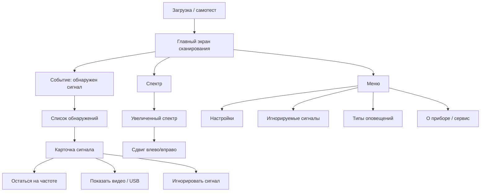

# UI Concept V1

Обновлено: 2026-04-30
Статус: черновой концепт

## Назначение

Этот файл нужен для первого грубого упорядочивания экранов, навигации и логики интерфейса.
Это не финальный дизайн, а рабочий каркас, от которого можно двигаться к макетам в `LVGL`.

## Основная Идея

У прибора есть два режима интерфейса:
- `Простой`: прибор жив, сканирует эфир, уведомляет о событиях, показывает минимум данных.
- `Продвинутый`: дает доступ к спектру, списку сигналов, детальному просмотру, удержанию на частоте, выводу видео и расширенным настройкам.

Главная мысль:
- в простом режиме пользователь почти всегда живет на одном главном экране;
- в продвинутом режиме вокруг главного экрана появляется исследовательский слой.

## Навигационная Схема



## Главный Экран

### Задача

Главный экран должен одним взглядом отвечать на четыре вопроса:
- прибор включен и работает?
- идет ли сканирование прямо сейчас?
- есть ли новые обнаружения?
- в каком состоянии батарея, звук, вибрация и время?

### Базовая Компоновка

```text
+--------------------------------+
| 12:41  BAT 78%  VOL 3  VIB ON |
+--------------------------------+
| СКАНИРОВАНИЕ      SIMPLE / PRO |
| Диапазон: Широкий              |
| Статус: эфир анализируется     |
+--------------------------------+
|                                |
|     ЖИВОЙ ВИД / СПЕКТР         |
|    ~~~~  ~~~ ~~ ~~~~~ ~~       |
|   ~~  ~~~~  ~~  ~~~  ~~~~      |
|    ~~~~~ ~~~  ~~~~~  ~~        |
|                                |
+--------------------------------+
| Обнаружения: 3                 |
| Новый: Видео TX, сильный       |
+--------------------------------+
| Энкодер: выбор   OK: открыть   |
| Назад: меню      Fn: режим     |
+--------------------------------+
```

## Экран Обнаружений

### Задача

После события обнаружения пользователь должен сразу увидеть:
- что именно найдено;
- насколько сигнал сильный;
- усиливается он или ослабевает;
- какие сигналы требуют внимания прямо сейчас.

### Черновой Вид

```text
+--------------------------------+
| 12:43  BAT 77%   ALERT         |
+--------------------------------+
| ОБНАРУЖЕННЫЕ СИГНАЛЫ       (4) |
+--------------------------------+
| > Analog video      -52 dBm ↑ |
|   Цель активна, рост уровня    |
|                                |
|   Digital burst     -67 dBm = |
|   Короткая активность          |
|                                |
|   Beacon            -80 dBm ↓ |
|   Сигнал затухает              |
+--------------------------------+
| OK: действия  Назад: сканер    |
+--------------------------------+
```

## Карточка Сигнала И Контекстное Меню

Для выбранного сигнала полезно держать компактную карточку и короткое меню действий:

```text
+--------------------------------+
| SIGNAL: Analog video           |
+--------------------------------+
| Частота: 1.2 GHz               |
| Уровень: -52 dBm               |
| Динамика: растет               |
| Статус: активен                |
| Комментарий: возможно видео TX |
+--------------------------------+
| > Остаться на частоте          |
|   Показать видео / USB         |
|   Игнорировать этот тип        |
|   Игнорировать этот источник   |
|   Назад                        |
+--------------------------------+
```

## Экран Спектра

### Базовый режим

Спектр здесь нужен не только для анализа, но и как индикатор того, что прибор действительно жив и ведет сканирование.

```text
+--------------------------------+
| СПЕКТР        Центр 1.2 GHz    |
+--------------------------------+
|                                |
|      /\        /\              |
|  /\ /  \  /\  /  \    /\       |
| /  \    \/  \/    \  /  \      |
|                                |
|--------------------------------|
| 900   1000  1100  1200  1300   |
+--------------------------------+
| Масштаб x1   OK: zoom          |
+--------------------------------+
```

### Увеличенный режим

В зуме пользователь должен перемещаться по спектру влево и вправо без перегрузки интерфейса.

```text
+--------------------------------+
| ZOOM x4     1180..1220 MHz     |
+--------------------------------+
|                                |
|     /\                         |
|    /  \      /\                |
|   /    \    /  \___            |
|__/      \__/       \__         |
|                                |
|-----------^--------------------|
|      окно просмотра            |
+--------------------------------+
| Влево/вправо: энкодер          |
| OK: выйти из zoom              |
+--------------------------------+
```

## Простой Режим

В простом режиме стоит сознательно убрать почти все исследовательские детали:
- не делать вход в подробный спектральный анализ центральным сценарием;
- не перегружать пользователя частотами и вторичными метриками;
- оставлять только факт работы, факт обнаружения и простые уведомления.

Подходящий состав экранов:
- главный экран;
- список обнаружений;
- карточка сигнала с 2-3 действиями;
- короткие настройки.

## Продвинутый Режим

В продвинутом режиме можно открыть:
- детальный спектр;
- zoom и панорамирование;
- удержание на частоте;
- попытку вывода видео на экран или USB;
- расширенный список фильтров, типов сигналов и правил игнорирования;
- сервисные и диагностические страницы.

## Верхняя Строка Статуса

Постоянная строка статуса выглядит очень уместно. Туда логично вынести:
- текущее время;
- заряд батареи;
- звук включен/выключен;
- вибрация включена/выключена;
- активный профиль: `Simple` или `Pro`;
- индикатор новых событий;
- при необходимости индикатор записи/USB/video.

## Управление

Пока разумно проектировать интерфейс под такой базовый набор:
- 1 поворотный энкодер с нажатием;
- 1 кнопка `Назад`;
- 1 кнопка `Меню`;
- 1 кнопка `Fn` или `Mode`;
- еще 1-3 дополнительные кнопки под быстрые действия.

Черновое назначение:
- вращение энкодера: перемещение по спискам, сдвиг спектра, изменение значения;
- нажатие энкодера: подтверждение, вход, открыть карточку;
- `Назад`: шаг назад, закрыть меню, выйти из zoom;
- `Меню`: открыть настройки или разделы;
- `Fn/Mode`: быстрое переключение `Simple/Pro`, mute, favorite screen или другая важная функция.

## Первые Принципы Дизайна

- Крупная типографика и короткие фразы.
- Сильная визуальная иерархия для событий обнаружения.
- Минимум мелкого текста на главном экране.
- У событий должен быть разный визуальный вес: новое, активное, затухающее, игнорируемое.
- Важно сохранить ощущение "прибор живой" даже когда интересных сигналов нет.

## Инструменты Дизайна Для LVGL

Сейчас наиболее здравый набор вариантов выглядит так:
- `EEZ Studio`: бесплатный и open-source редактор с поддержкой `LVGL`, хороший кандидат для этого проекта.
- `LVGL Editor / LVGL Pro`: официальный редактор от команды `LVGL`, но бесплатный community-вариант ограничен публичными open-source/non-commercial сценариями.
- `SquareLine Studio`: популярный сторонний редактор для `LVGL`, но коммерческие условия нужно отдельно проверять перед использованием.

Практический вывод для старта:
- если нужен бесплатный путь без лишних лицензионных сюрпризов, разумнее всего сначала пробовать `EEZ Studio`;
- если позже понадобится более плотная связка с экосистемой `LVGL`, можно отдельно оценить официальный `LVGL Editor`.

## Что Полезно Уточнить Следующим Сообщением

- Какие типы сигналов действительно нужны пользователю как отдельные категории.
- Нужно ли сохранять историю обнаружений.
- Нужно ли вручную помечать сигнал как важный.
- Что означает "заблокировать уведомления": по типу, по диапазону, по частоте, по источнику или временно до перезапуска.
- Какие действия должны быть доступны прямо с главного экрана по быстрым кнопкам.
